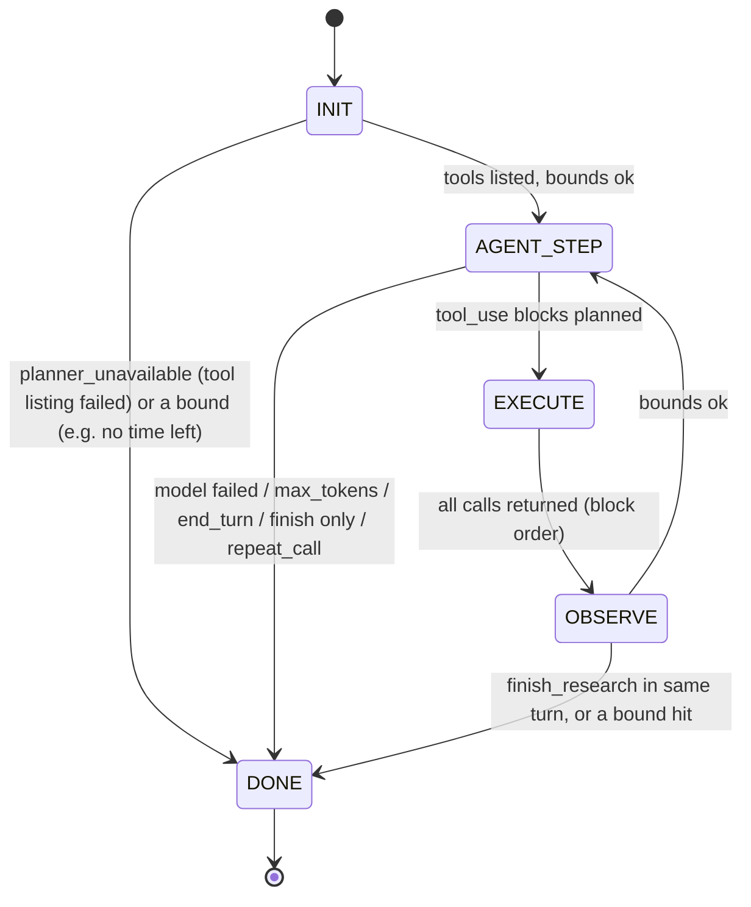

# Research agent deep dive (Phase 4)

**Last updated:** 2026-10-06 · **Code:** `backend/src/marketsignal/agent/` (`state.py`, `runtime.py`, `execute.py`, `pool.py`, `progress.py`, `prompts.py`, `transcript.py`), `runs/router.py`, `runs/research.py`, `runs/executor.py`, `api/routers/runs.py`, `api/app.py` · **Decisions:** ADR-0007 (bounded state machine), ADR-0015 (modes and router), ADR-0018 (personas), ADR-0006 (governed tools)

This document describes research mode as the code implements it at HEAD. The tools the agent calls, and the governance around them, are in [`GOVERNED_TOOLS_AND_MCP.md`](GOVERNED_TOOLS_AND_MCP.md). The shared tail (pack, synthesis, verification, persistence, SSE) is in [`GROUNDED_ANSWERING.md`](GROUNDED_ANSWERING.md). Where everything sits in the system is in [`SYSTEM_DESIGN.md`](SYSTEM_DESIGN.md).

> **Measurement status.** The behaviour below is enforced by deterministic code and covered by unit and integration tests run against a scripted `FakeAgentLLM`. Live results (research-v0, standard vs research, latency, cost, tool-call counts): see [`docs/phase-reports/phase-4.md`](phase-reports/phase-4.md).

## The question this document answers

> *How can a language model choose its own searches over workspace evidence without being able to run forever, leave the workspace, leak its reasoning, or make the final answer less grounded than standard mode?*

The answer in one paragraph: a deterministic router picks the mode without calling a model. In research mode, the model is one step function inside an explicit state machine. Every loop iteration is one model call, and a fixed list of bounds is checked before each one. The model reaches data only through four governed tools, and each call carries a run-scoped capability token. The agent collects **handles only** into an evidence pool. Its prose and thinking stay in an in-memory transcript that is never streamed, logged or stored. The pool is then re-resolved in the workspace scope and passed to the same pack → synthesis → verifier tail as standard mode. When the agent cannot plan, or ends with nothing, the standard gather runs in the time that is left.

## 1. Router

`runs/router.py::route(question, *, requested, persona, recent_questions)` returns a `RouteDecision`. It is a pure function with no model call.

**Precedence, highest first**:

| # | Input | Decision | `reason` |
|---|---|---|---|
| 1 | request `mode` = `standard` or `research` | that mode | `explicit_request` |
| 2 | request `mode` = `auto` | cue rules (overrides the persona default) | `auto_cues` / `auto_no_cue` |
| 3 | no request mode, persona default `standard` or `research` | the persona default | `persona_default` |
| 4 | no request mode, persona default `auto` (or unknown persona) | cue rules | `persona_auto_cues` / `persona_auto_no_cue` |

"Absent" and `auto` are different. In `api/routers/runs.py`, `RunCreate.mode` is `Literal["auto","standard","research"] | None = None`. An absent mode lets the persona default apply. `auto` always applies the cue rules. Any other value raises `ValueError` in `route()` (the Pydantic model rejects it first).

**Persona defaults** (`PERSONA_DEFAULT_MODES`): `generalist` → `auto`, `customer_insights` → `standard`, `growth_strategy`, `brand_strategy` and `marketing_strategy` → `research`. An unknown persona behaves like `generalist`.

**Cue rules** (`cues()`). Fired cues are returned in this fixed order. Any fired cue selects `research`:

| Cue | Fires on (case-insensitive) |
|---|---|
| `hypothesis` | hypothesis/hypotheses, evaluate, "assess whether", "test whether", "is it true that", validate |
| `comparison` | vs/vs., versus, compare/compared, comparison, "relative to", "which competitor(s)" |
| `numeric` | `%`, "how many", percent/percentage, trend(s)/trending, "by segment/region/channel/cohort", breakdown/break(s) down |
| `multi_class` | cues for **two or more** of the five classes (customer, competitor, market, financial, internal) |
| `follow_up` | only when there are earlier questions: a leading and/also/"what about"/"how about"/why/so, or a pronoun (it, they, that, those, these, this, them) within the first four words |

The customer-class cue matches the plural **"reviews"** only, because a singular "review" is usually a meeting or a document ("Q3 review"). The internal class matches "strategy review".

**Recorded route.** `RouteDecision.as_dict()` (`requested`, `persona_default`, `decided`, `reason`, `cues`) is stored in `query_runs.route` when the run row is inserted (`runs/store.py::create_run`). It is also returned in the `202` body and sent in `run_started` (`mode`, `route`). Tests: `tests/unit/test_router.py`.

## 2. Research gather inside the executor

The modes differ only in the gather step (`runs/executor.py::StandardRunExecutor._run`). When `req.mode == "research"` and an agent factory is wired (`api/app.py` always wires one), the executor calls `runs/research.py::research_gather`:

1. **One gather deadline.** `gather_deadline = start + run_gather_budget_s` (35 s). The agent stops at the earlier of that and its own `agent_gather_budget_s` (35 s). The standard fallback gets only what is left of the same deadline (`_standard_gather(..., deadline=research.gather_deadline)`). If no time is left, the fallback reports `RETRIEVAL_TIMEOUT` (`tool_failure`) without starting a search.
2. **Capability token.** `tools/capability.issue(...)` mints an HS256 token with `jti` = run id, the workspace id and code, `principal="api"`, the persona, `tools=TOOL_NAMES` (all four), `max_conf` = the workspace's LLM confidentiality ceiling, the run's `source_classes` (the `classes` claim) and `ttl_s = min(3600, agent_gather_budget_s + 60)`. The token is revoked as soon as the run stops being `running` (§2 of the tools doc).
3. **Agent.** `ResearchAgent.gather(AgentContext(...))`. The context carries the question, persona, conversation summary and recent questions, the credential, the deadline, the progress sink and the run's class filter. `AgentContext.__repr__` omits the credential and the question.
4. **Record.** Flags are added to the run, and `write_agent_record` writes `query_runs.agent` and `query_runs.tool_calls` (§9).
5. **Fallback or pool.** If the stop reason is `planner_unavailable` or `no_successful_search` (`FALLBACK_STOPS`), the executor runs the Phase 3 standard gather with `step = outcome.steps + 1`. Otherwise `pool_to_candidates` turns the pool into ranked parents (§8). A `tool_errors` stop with an empty result adds the `tool_failure` state.

If `mode == "research"` but no agent factory is wired, the run is flagged `RESEARCH_UNAVAILABLE` and the standard gather runs. Only tests construct the executor this way.

From this point on, research and standard runs are the same: pack, freeze, synthesis, verification, persist, `final`, `done`.

## 3. State machine

`agent/state.py` holds the states, the transition table and the bound check. `agent/runtime.py::_GatherRun` runs the loop.

`TRANSITIONS` (enforced by `StateMachine._go`, which raises `InvalidTransitionError` on any other edge):

| From | Allowed to |
|---|---|
| `INIT` | `AGENT_STEP`, `DONE` |
| `AGENT_STEP` | `EXECUTE`, `DONE` |
| `EXECUTE` | `OBSERVE` |
| `OBSERVE` | `AGENT_STEP`, `DONE` |
| `DONE` | (none) |

`DONE` can only be entered through `stop(reason)`, so every exit carries a `StopReason`. The history is kept (`AgentOutcome.states`) and persisted as `agent.states`. Bound checks run at the top of every iteration (`iterate`). That is "before the next model call", so after `INIT` and after `OBSERVE`. A bound hit at those points records `DONE` from that state.

### 3.1 One iteration (`_GatherRun.iterate`)

1. `check_bounds(progress, bounds)`: stop on the first bound hit.
2. `AGENT_STEP`: one model call (`model_step`). `steps += 1`. The request carries `RESEARCH_SYSTEM_PROMPT`, the whole transcript, the tool array, `max_tokens`, `effort` and `timeout_s = remaining`. It is wrapped in `asyncio.wait_for(remaining + 0.5 s)` as a backstop. Any exception means no turn.
   - No turn on step 1 → `planner_unavailable`. On a later step → `time_limit` if the deadline has passed, else `llm_unavailable`.
3. Append the assistant content to the transcript, then account usage (`output_tokens` summed; `context_tokens` = this request's input + cache read + cache creation + output).
4. `stop_reason == "max_tokens"` → `token_limit` (a truncated turn's `tool_use` input is unreliable, so nothing runs).
5. No `tool_use` blocks → `end_turn` (any prose is discarded).
6. `finish_research` present → parse `sufficient` and `gaps`. With no other calls in the turn → `finish_research`.
7. `plan()` the other calls (budget and repeat policy, §5). A 2nd repeat → `repeat_call`.
8. `EXECUTE`: run the calls concurrently (§4). `OBSERVE`: fold the results into counters, the pool and the trace, and build the `tool_result` blocks.
9. If `finish_research` was in this turn → `finish_research` (the other calls ran and their results are pooled, but no further model step follows). Otherwise append the tool results and add their UTF-8 bytes ÷ 3 to the context estimate (an over-estimate for ASCII; at least one token per CJK character).

### 3.2 Bounds

`AgentBounds.from_settings` reads every bound from `config.Settings` (`MS_` environment prefix). `check_bounds` runs them **in this fixed order**, so the reported reason is deterministic when several are hit at once:

| Order | Bound | Default (setting) | Stop reason | Run flag |
|---|---|---|---|---|
| 1 | Gather time left ≤ 0 | 35 s (`agent_gather_budget_s`), capped by the run's gather deadline (`run_gather_budget_s` 35 s) | `time_limit` | `GATHER_TIMEOUT` |
| 2 | Consecutive tool errors | 3 (`agent_max_consecutive_tool_errors`, 1–10) | `tool_errors` | `TOOL_CIRCUIT_OPEN` |
| 3 | Evidence pool size | 40 (`evidence_pool_max`) | `pool_full` | none (a normal exit) |
| 4 | Model steps | 4 (`agent_step_limit`, 1–10) | `step_limit` | `AGENT_STEP_BUDGET_EXHAUSTED` |
| 5 | Executed tool calls | 10 (`agent_max_tool_calls`, 1–30) | `tool_limit` | `AGENT_STEP_BUDGET_EXHAUSTED` (same flag, plan §19) |
| 6 | Output tokens summed over steps | 12,000 (`agent_max_output_tokens_total`) | `token_limit` | `AGENT_TOKEN_BUDGET_EXHAUSTED` |
| 7 | Estimated next-request context | 40,000 (`agent_max_context_tokens`) | `context_limit` | `AGENT_CONTEXT_LIMIT` |

Bounds enforced elsewhere in the loop:

| Bound | Default (setting) | Effect |
|---|---|---|
| Per-step output | 4,096 (`agent_max_tokens`) | `stop_reason=max_tokens` → `token_limit` |
| Effort | `low` (`agent_effort`) | sent as `output_config.effort` |
| Per-call tool timeout | 8 s (`tool_timeout_s`), clamped to the gather time left | `TIMEOUT` error, counts toward the error streak |
| Observation size | 1,000 tokens (`obs_max_tokens`, about 4 chars per token) | observation clipped before it enters the transcript |
| Identical call | 3rd identical (tool, canonical args) = 2nd repeat (`AgentBounds.repeat_stop_at`, not a setting) | `repeat_call`, `AGENT_REPEAT_CALL_STOPPED` |
| Calls in one turn beyond the remaining budget | — | denied without running (`POLICY_DENIED`, §5) |

Other stop reasons and flags: `finish_research` and `end_turn` (no flag), `planner_unavailable` (`PLANNER_UNAVAILABLE_FALLBACK`), `llm_unavailable` (`AGENT_LLM_UNAVAILABLE`) and `no_successful_search` (`PLANNER_NO_TOOL_FALLBACK`). The mapping is `STOP_FLAGS` in `agent/state.py`.

**Empty-handed rewrite.** In `_GatherRun.outcome`, if gathering ends with zero successful evidence calls and an empty pool, the reason becomes `no_successful_search`, and `PLANNER_NO_TOOL_FALLBACK` is appended after the original bound's flag. There are three exceptions: `planner_unavailable`, a reason that is already `no_successful_search`, and a `time_limit` with no time left before the run's gather deadline. The executor then runs the standard gather with whatever time is left. "Evidence calls" are `search_evidence`, `search_evidence_keyword` and `get_evidence` (`list_sources` alone does not count).

**Model and thinking.** The agent uses the synthesis provider (`api/app.py::_agent_llm`) when that provider implements `step` (Anthropic). Otherwise it uses a stand-in whose every step is unavailable, which produces `planner_unavailable` and the standard gather. The same applies when the provider cannot be built, for example with no API key. With the default `llm_thinking="disabled"`, the provider sends `thinking: {"type": "between_tools"}` (Claude 5.x rejects `disabled`). Short between-call updates then arrive as thinking blocks. No `tool_choice` is sent, so it is `auto` (the spike found `tool`/`any` rejected). The provider makes one jittered retry on 429/529/5xx when budget remains (`providers/llm/anthropic.py`, SDK `max_retries=0`).

## 4. Transcript

`agent/transcript.py::Transcript` is **append-only**:

- The first message is the user turn built by `prompts.research_user_message`, inside `<research_request>`. It holds the persona, the run's class filter stated as validated enum values in `<source_scope>`, the earlier questions and summary escaped (`&`, `<`, `>`) inside `<conversation_context>` (marked as data in the system prompt), and the question.
- Every assistant `content` (thinking and redacted thinking blocks, including empty ones, plus text and `tool_use`) is stored as a private deep copy and resent **byte-identical** on every later step. Claude binds thinking blocks to the exact prefix, so nothing already sent is edited.
- Each step's `tool_result` blocks follow in the model's `tool_use` block order. Successful observations are wrapped by `wrap_observation` with a header that marks them as untrusted data and a `<tool_output tool="…">` element. Failures are `Tool error {code}: {message}` with `is_error: true`.
- There is no trimming. When the context bound is reached, gathering stops.
- The transcript lives only for the duration of `gather()`. Thinking and prose are never streamed, logged or persisted. Progress events, the outcome, the trace and logs are built only from validated tool arguments, tool status and counters (`test_no_thinking_or_prose_in_events_outcome_or_trace`).

The tool array is the governed tools sorted by name, with `finish_research` last (`load_tools`), for prompt-cache stability.

## 5. Tool calls: budget, repeats, parallelism, ordering

**Planning** (`_GatherRun.plan`, before anything runs):

- `budget = max_tool_calls − tool_calls`. Only the first `budget` blocks of a turn are considered. Every block after them is `deny_budget`: there is no repeat check, no per-call progress event and no audit row, and the whole overflow gets **one aggregated trace entry** (`tool: "unknown"`, `error_code: "POLICY_DENIED"`, `denied_calls: n`). The model still gets a `POLICY_DENIED` `tool_result` for each one.
- Repeat detection uses `canonical_call_key(name, args)`: tool name + JSON of `canonical_args`. Arguments are contract-validated (whitespace stripped, nulls dropped), tool defaults are filled in (`search_evidence.top_k=8`, `search_evidence_keyword.match="all"`, `limit=10`), and internal whitespace is collapsed. The set-like lists `source_classes`, `source_codes`, `handles` and `terms` are sorted and de-duplicated (empty lists dropped). Keyword terms are case-folded, and a `phrase` match keeps its term order. Arguments that fail validation fall back to their raw sorted-key JSON. The 2nd occurrence of a key is `deny_repeat` (`POLICY_DENIED`, "Identical call already made…"). The 3rd stops gathering (`repeat_call`).

**Execution** (`agent/execute.py::execute`): the `run` calls start concurrently in one `asyncio.TaskGroup`, each through `ToolTransport.call` with the run's credential. Every call therefore gets its own capability check and audit row. Each is bounded by `min(tool_timeout_s, remaining)`. A timeout becomes `TIMEOUT`, and an unexpected exception becomes `INTERNAL`. Cancellation cancels them all. Results are recorded **in the model's block order**, never in completion order, so the transcript, trace, pool and events are deterministic (`test_pool_order_is_deterministic_regardless_of_completion_order`).

**Counting** (`observe`): only executed calls count toward `tool_calls`. A success resets the consecutive-error streak, and a failure (including `NOT_FOUND`, `TIMEOUT` and `UNAUTHENTICATED`) extends it. Denied calls count toward neither.

## 6. `finish_research`

`finish_research` is a harness-local tool (`agent/prompts.py::FINISH_RESEARCH_SPEC`, strict schema `{sufficient: bool, gaps: string[]}`, both required). It is never sent to the governed tools. `parse_finish` reads it leniently: at most `GAPS_MAX_ITEMS` (5) gaps, each made printable, collapsed to one line and cut to `GAP_MAX_CHARS` (200). If the same turn has data-tool calls, they run and are pooled, then gathering stops. `sufficient` and the gap **count** are persisted. The gap text is not (it is model-written). The system prompt forbids answering the question and treats tool output as untrusted data.

## 7. Progress events

`agent/progress.py` builds every event from validated arguments and tool status (the Phase 4 SSE contract). `research_gather` passes only `status`, `tool_started` and `tool_completed` through `progress_emitter`. That emitter is **best-effort**: a failed event write is logged by exception type only (never the payload) and skipped. Every emit is also bounded by the gather deadline, and an emit after the deadline is skipped.

| Event | When | Payload |
|---|---|---|
| `status` | gather start | `{"phase": "planning", "message": "Planning the research"}` |
| `status` | before the first executed batch | `{"phase": "searching", "message": "Searching workspace evidence"}` |
| `tool_started` | per planned call that is not budget-denied | `step`, `call_index`, `tool`, `kind` (`search`/`keyword`/`lookup`/`catalog`), `summary` |
| `tool_completed` | per such call, after the batch | `step`, `call_index`, `tool`, `status` (`ok`/`error`/`denied`/`timeout`), `result_count`, `duration_ms`, optional `error_code` |

Summary templates (`summarize`):

| Tool | Template | Example |
|---|---|---|
| `search_evidence` | `Searching {classes} evidence for "{query}"` | `Searching customer and competitor evidence for "checkout abandonment drivers"` |
| `search_evidence_keyword` | `Checking exact identifiers: "{t1}", "{t2}"` | `Checking exact identifiers: "RV-00412"` |
| `get_evidence` | `Opening {n} evidence item(s)` | `Opening 3 evidence items` |
| `list_sources` | `Listing {classes} sources` | `Listing all sources` |
| invalid arguments | `Running a tool call with invalid arguments` | — |

`{classes}` is `all`, one class, or "a, b and c". Model text appears only quoted. `quote()` makes it printable (controls, format characters and lone surrogates become spaces), turns `"` into `'`, collapses it to one line and truncates it to `QUOTE_MAX_CHARS` (80) with `…`. `tool_label()` shows only a known tool name, otherwise `unknown`. When the standard gather runs as the fallback, it emits its own `tool_started`/`tool_completed` for `search_evidence` (summary `hybrid search`) at `step = agent steps + 1`.

## 8. Pool → candidates

`agent/pool.py::EvidencePool` holds handles plus the tool-reported D1 anchor, never document text:

- De-duplicated by handle and bounded by `evidence_pool_max`. New handles beyond the bound are refused, and a full pool stops gathering at the next bound check (`pool_full`).
- Hits from `search_evidence`/`search_evidence_keyword` add the hit's `fused_rank` and anchor. A found `get_evidence` item adds the handle with rank = its position and no anchor. An item missing as `NOT_FOUND`/`SOURCE_DELETED` is **discarded** from the pool.
- A later, better-ranked sighting with an anchor replaces the anchor but keeps `first_step` and `via_tool`.
- Order (`items()`): best fused rank, then first step, then first-seen order.

`pool_to_candidates(factory, scope, pool, source_classes=...)` re-resolves every handle in one RLS-scoped query with an explicit `workspace_id` predicate. Before the query, it drops handles without the `"{workspace_code}/"` prefix. The query drops unknown handles, deleted sources, purged versions (`v.status <> 'purged'`) and, when the run has a class filter, any other class (the class comes from the database, whatever the tool reported). The anchor is the tool's child if it still belongs to that parent, else the parent's first child. Spans always come from the database. Candidates keep pool order as ranks 1..n on lane `agent`. Tests: `tests/integration/test_agent_pool.py`.

## 9. What is persisted

| Where | Content | Never |
|---|---|---|
| `query_runs.route` | the router decision (§1) | — |
| `query_runs.agent` | `stop_reason`, `flags`, `steps`, `tool_calls`, `tool_errors`, `states`, `pool_size`, `sufficient`, `gap_count`, `usage` (input/output/cache tokens, `llm_attempts`), `trace`, `duration_ms` | model prose, thinking, gap text |
| `query_runs.agent.trace[]` | per handled call: `step`, `call_index`, `tool`, `args` (validated and scrubbed), `status`, `error_code`, `handles`, `duration_ms`; plus one aggregated overflow entry | observations, document text |
| `query_runs.tool_calls` | executed call count | — |
| `tool_runs` | one audit row per governed call (see the tools doc) | credentials, observations |
| `run_events` | `status`, `tool_started`, `tool_completed`, then the shared tail | — |
| `query_runs.timings.agent_ms` | gather duration | — |

`write_agent_record` writes `agent` and `tool_calls` in one transaction. It holds `FOR KEY SHARE` on the run row (the lock a purge takes `FOR UPDATE`). If any traced handle's version is purged by then, the trace is replaced by `"trace_redacted": true` and only counts, states and usage are kept. Either the purge sees this write and strips the trace itself, or this write sees the purge (`test_agent_record_written_after_a_purge_drops_the_trace`). Purge treats a run as affected when its pack included the source **or** one of its `tool_runs` returned a handle of it. For such runs, purge deletes the event log and the verification reports, sets `tool_runs.args` to `{"redacted": true}` and replaces `agent.trace` with `trace_redacted` (`ingestion/purge.py`; `test_purge_redacts_agent_tool_args_and_trace_of_runs_that_saw_the_source`).

## 10. Failure modes

| Situation | Stop reason | Flag(s) | What the run does |
|---|---|---|---|
| Tool listing fails, or the first model call fails or times out | `planner_unavailable` | `PLANNER_UNAVAILABLE_FALLBACK` | standard gather in the remaining gather time |
| No provider with `step` (e.g. fake, or no API key) | `planner_unavailable` | `PLANNER_UNAVAILABLE_FALLBACK` | standard gather |
| Any stop with zero successful evidence calls and an empty pool | `no_successful_search` | original flag + `PLANNER_NO_TOOL_FALLBACK` | standard gather |
| Later model call fails, pool non-empty | `llm_unavailable` | `AGENT_LLM_UNAVAILABLE` | answer from the pool |
| Gather time used up | `time_limit` | `GATHER_TIMEOUT` | answer from the pool; if empty and no time left, no fallback search: the empty pack abstains |
| Fallback finds no time left | — | `RETRIEVAL_TIMEOUT` | `tool_failure` |
| 3 consecutive tool errors | `tool_errors` | `TOOL_CIRCUIT_OPEN` | answer from the pool; `tool_failure` state if nothing resolved |
| Step, call, token or context bound | `step_limit` / `tool_limit` / `token_limit` / `context_limit` | see §3.2 | answer from the pool |
| Truncated model turn | `token_limit` | `AGENT_TOKEN_BUDGET_EXHAUSTED` | truncated calls are not run |
| 2nd repeat of an identical call | `repeat_call` | `AGENT_REPEAT_CALL_STOPPED` | answer from the pool |
| HTTP tool transport unreachable | — | `TOOLS_TRANSPORT_FALLBACK` (once) | call re-run in process |
| Run cancelled or deadline hit | `CancelledError` propagates; running tool calls are cancelled | — | `cancelled` / `timeout` (shared tail) |
| Progress event write fails | — | — | logged by type, skipped; the outcome is still persisted |
| Purge during or after the gather | — | — | pooled handles of purged versions are dropped at `pool_to_candidates`; trace and args redacted |

Agent flags do not change the termination state, except that a `tool_errors` stop that resolves nothing reaches `tool_failure`. The tests that drive each row are in `tests/unit/test_agent_termination.py`, `tests/unit/test_agent_hardening.py` and `tests/integration/test_research_runs.py`.

## 11. Evaluation

`eval/datasets/research-v0` (57 fictional items, nine categories, dev/test split by leakage group, a `router_expectation` per item) is run through the grounded harness once per mode. `evaluation/grounded_compare.py` pairs the two runs by item id (paired bootstrap CI and exact McNemar for rates). `evaluation/grounded_stats.py` reads `route` and `agent` from `query_runs`. Results: see [`docs/phase-reports/phase-4.md`](phase-reports/phase-4.md).

## 12. Known limits

- Only the default mode of each persona exists (router table). Persona prompt policies and source-class priors are not built (ADR-0018).
- No analytics or hypothesis tools; the agent cannot compute over datasets (ADR-0006).
- No follow-up query rewriting: `standalone_query` is the question. The agent sees the conversation context; standard retrieval does not.
- Cancel is process-local; there is no spend ledger or rate limit (`SYSTEM_DESIGN.md` §9).
- `finish_research` gaps are not passed to synthesis; the synthesis prompt is the same as in standard mode.
