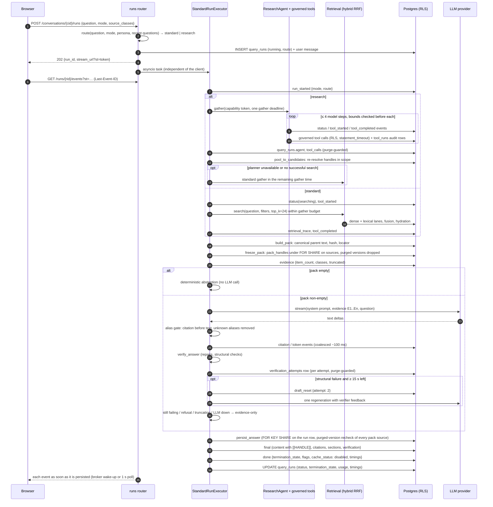

# System design (as built through Phase 4)

**Last updated:** 2026-10-06 · **Scope:** what the code does today, through Phase 4 (standard and research modes, governed tools, verifier precision). Anything planned but not built is listed under [Deferred](#9-deferred). The approved target design is [`ARCHITECTURE_PLAN.md`](ARCHITECTURE_PLAN.md); where the two differ, the plan's §0.4 deviation register records why.

> **Live validation status.** Phase 4 (research mode, governed tools, verifier precision) is implemented and tested against scripted models. For its live results, see [`docs/phase-reports/phase-4.md`](phase-reports/phase-4.md). Phase 3: the live Anthropic spike and the live grounded evaluation ran on 2026-10-06. All six hard gates passed; end-to-end p50/p95 was 4.8 s / 9.6 s and the 76-item run cost about $1.00. Live results (2026-10-06, `claude-sonnet-5-5`, effort low, no thinking): [`docs/phase-reports/phase-3.md`](phase-reports/phase-3.md), [spike 0002](spikes/0002-anthropic-live.md), and `eval/baselines/phase3/live-v0/`.

Companion documents:
- [`GROUNDED_ANSWERING.md`](GROUNDED_ANSWERING.md): generation and streaming in depth (pack, prompt, alias gate, verifier and its Phase 4 precision rules, SSE, purge during a run, evaluation).
- [`RESEARCH_AGENT.md`](RESEARCH_AGENT.md): the router and the bounded research agent (state machine, bounds, transcript, progress events, pool, persistence, failure modes).
- [`GOVERNED_TOOLS_AND_MCP.md`](GOVERNED_TOOLS_AND_MCP.md): the four governed tools, capability tokens, the governance pipeline, audit, the in-process and MCP Streamable HTTP transports, and the threat model.
- [`RETRIEVAL_DEEP_DIVE.md`](RETRIEVAL_DEEP_DIVE.md): the retrieval pipeline and its measurements.
- [`INGESTION.md`](INGESTION.md): how a file becomes citable evidence.

---

## 1. Components

```
 Browser (Next.js)                          FastAPI process (backend/src/marketsignal)
 ┌──────────────────────────┐   POST   ┌───────────────────────────────────────────────────┐
 │ components/chat/*        │ ───────▶ │ api/routers/runs.py                               │
 │  chat-view, question-form│          │   create run row + user message, spawn task       │
 │  answer-view, safe-md    │ ◀─ SSE ─ │   GET /runs/{rid}/events (replay + live tail)     │
 │  citation-chip, notices  │          │ runs/router.py    deterministic mode router       │
 │ lib/run-stream.ts        │          │ runs/executor.py  StandardRunExecutor (asyncio)   │
 │  (pure event reducer)    │          │   standard: retrieval/pipeline.py hybrid RRF      │
 └──────────────────────────┘          │   research: runs/research.py → agent/* (bounded)  │
                                       │     → tools/* governor (in-process | /mcp HTTP)   │
                                       │     → agent/pool.py pool_to_candidates            │
                                       │   generation/pack.py     evidence pack E1..En     │
                                       │   generation/prompts.py  static system prompt     │
                                       │   providers/llm/*        anthropic | fake         │
                                       │   generation/aliases.py  streaming alias gate     │
                                       │   generation/verifier.py deterministic verifier   │
                                       │   generation/fallback.py abstention/evidence-only │
                                       │   runs/synthesis.py      generate + verify loop   │
                                       │   runs/finalize.py       persist, final, fallbacks│
                                       │   runs/events.py         EventWriter (seq, flush) │
                                       │   runs/store.py          persistence + locking    │
                                       │   runs/broker.py         in-process wake-ups      │
                                       │   runs/reaper.py         orphaned-run reaper      │
                                       │   ingestion/purge.py     purge (incl. run data)   │
                                       └───────────────────────┬───────────────────────────┘
                                                               │ RLS-scoped sessions (ms_app)
                                       ┌───────────────────────▼───────────────────────────┐
                                       │ PostgreSQL 18 + pgvector                           │
                                       │  evidence: sources, source_versions, parent_chunks,│
                                       │   child_chunks, embeddings, …   (Phases 1–2)       │
                                       │  runs: conversations, messages, query_runs,        │
                                       │   run_events                    (migration 0004)   │
                                       │  tool_runs, verification_attempts (0005, 0006)     │
                                       │  retrieval_traces               (migration 0003)   │
                                       └────────────────────────────────────────────────────┘
```

| Module | Purpose | Key exports |
|---|---|---|
| `api/routers/runs.py` | Conversations, run start, run status, cancel, SSE stream | `start_run`, `run_events`, `cancel_run`, `authorized_stream` |
| `api/app.py` | Wiring: lazy LLM provider, agent model factory, tool governor and transport, `/mcp` mount and its session-manager task, run broker, task registry, reaper loop, SSE headers | `create_app`, `lifespan` |
| `runs/router.py` | Deterministic, user-overridable mode router (no model call) | `route`, `cues`, `RouteDecision`, `PERSONA_DEFAULT_MODES` |
| `runs/research.py` | Research gather: capability token, agent, persisted agent record, fallback decision | `research_gather`, `write_agent_record`, `agent_record` |
| `agent/*` | Bounded research agent: state machine and bounds, runtime loop, concurrent tool execution, evidence pool, progress events, prompts, append-only transcript | `ResearchAgent`, `AgentBounds`, `check_bounds`, `pool_to_candidates` |
| `tools/*` | Governed tool contract, capability tokens, governance pipeline, registry, strict-schema adapter, observations, in-process and fallback transports, four tool implementations | `ToolGovernor`, `TOOL_NAMES`, `issue`/`verify`, `InProcessToolTransport`, `FallbackToolTransport` |
| `mcp/*` | MCP Streamable HTTP server over the governor (loopback guard, bearer check) and its client transport | `build_mcp_app`, `GovernedMCPServer`, `HttpToolTransport` |
| `runs/verification_log.py` | One `verification_attempts` row per verified attempt (purge-guarded) | `record_attempt`, `disposition` |
| `runs/executor.py` | Orchestration of a run (standard gather, or research gather with standard fallback): deadline scope, bounded conclusion (`_conclude`), publish and terminate | `StandardRunExecutor`, `RunRequest`, `termination_state` (re-exported) |
| `runs/synthesis.py` | Grounded generation through the alias gate, verification, the one regeneration | `generate_and_verify`, `generate`, `provider_stream`, `emit_gate` |
| `runs/finalize.py` | Persist the verified answer, emit `final`, advance the conversation; the source-deleted fallback | `finish`, `source_deleted_fallback`, `advance_conversation`, `without_sources`, `present_classes` |
| `runs/flags.py` | Degradation flags, termination precedence, status text | `PRECEDENCE`, `termination_state`, `STATUS` |
| `runs/state.py` | Run request and per-run state shared by the three modules above | `RunRequest`, `_RunState`, `_Answer`, `_Outcome`, `_SourceWithheldError` |
| `runs/events.py` | The only path for emitting events: persist, then wake subscribers; drops draft text once the store withheld some | `EventWriter`, `EVENT_TYPES` |
| `runs/store.py` | Conversations, runs, events, answers; the purge-safe write protocol | `create_run`, `freeze_pack`, `append_event`, `persist_answer`, `advance_conversation_state` |
| `runs/broker.py` | In-process notification for live tails | `RunBroker` |
| `runs/reaper.py` | Closes runs whose process died; skips runs still live in this process | `reap_interrupted_runs`, `reap_run`, `live_run_ids`, `synthesized_done` |
| `runs/tokens.py` | Short-lived SSE stream tokens (HS256 JWT) | `issue`, `verify` |
| `runs/conversation.py` | Bounded, deterministic conversation state | `next_state` |
| `generation/*` | Pack, prompt, gate, contract, verifier, fallbacks | see [`GROUNDED_ANSWERING.md`](GROUNDED_ANSWERING.md) |
| `providers/llm/*` | Streaming LLM interface; Anthropic and scripted fake | `LLMProvider`, `AnthropicProvider`, `FakeLLM` |
| `evaluation/grounded.py` | End-to-end grounded evaluation through the in-process API (either mode) | `evaluate`, `summarize` |
| `evaluation/grounded_stats.py`, `grounded_compare.py`, `numeric_recheck.py`, `verifier_eval.py` | Pipeline statistics (incl. `route`/`agent`), paired standard-vs-research comparison, independent numeric re-check, verifier precision harness | — |

## 2. Data model (migrations 0004–0006)

All six run-side tables are tenant tables: `workspace_id` on every row, composite `(workspace_id, id)` foreign keys, and **ENABLE + FORCE row-level security** with the policy `workspace_id = app.current_workspace()` for both `USING` and `WITH CHECK` (`backend/migrations/versions/0004_runs_and_conversations.py`, `0005_agent_tools_verification.py`, `0006_tool_runs_args_redaction.py`).

| Table | Holds | Notes |
|---|---|---|
| `conversations` | persona, title, `rolling_summary`, `recent_questions[]`, `recent_handles[]`, `summary_through_message_id` | Bounded state only. No transcript is replayed into prompts. |
| `messages` | user questions and **verified** assistant answers: `content`, `citations` (jsonb cards), `sections` (jsonb), `status`, `query_run_id`, `model`, `usage` | Content holds canonical `[[HANDLE]]` markers only, never `[E#]` aliases. `status ∈ complete, incomplete, failed, redacted`; the code currently writes `complete` (answers) and `redacted` (purge). |
| `query_runs` | one row per question: `mode`, `persona`, `original_query`, `normalized_query`, `standalone_query`, `retrieved_handles[]`, `pack_handles[]`, `cited_handles[]`, `pack_tokens`, `context_tokens`, `models`, `usage`, `cache_status` (default `'disabled'`), `timings`, `status`, `termination_state`, `degradation_flags[]`, `config_hash`, `prompt_version`, `corpus_version_start`, `error_class` | Stores handles, never document text. `mode ∈ standard, research`. `status ∈ running, completed, failed, cancelled, interrupted`. |
| `query_runs` (0005 columns) | `route` jsonb (router decision: `requested`, `persona_default`, `decided`, `reason`, `cues`), `agent` jsonb (stop reason, flags, steps, tool calls and errors, state path, pool size, `sufficient`, gap count, usage, per-call trace or `trace_redacted`), `tool_calls` integer (executed governed calls, written once after the gather) | Never model prose, thinking or `finish_research` gap text. Written by `runs/research.py::write_agent_record` under the purge guard |
| `tool_runs` (0005) | one audit row per governed tool call: `step`, `call_index`, `tool`, sanitized `args`, `status`, `error_code`, `result_handles[]`, `result_count`, `total_matches`, `truncated`, `warnings[]`, `duration_ms`, `transport` | No observation or document text. `UPDATE` revoked from `ms_app` except **`UPDATE (args)`** (migration 0006), so purge can redact arguments in place |
| `verification_attempts` (0005) | one row per verified synthesis attempt: `attempt` (1–3), `disposition` (`accepted`, `repaired`, `regenerate`, `rejected`, `fallback`), `report` jsonb | Append-only for `ms_app`. Reports quote model spans, so purge deletes the rows of affected runs |
| `run_events` | the SSE event log: `(workspace_id, run_id, seq)` primary key, `type`, `payload` jsonb | Append-only for the runtime role (`REVOKE UPDATE … FROM ms_app`). Replayed on reconnect. Retention (30 days) is the Phase 8 nightly job. |

Indexes: `tool_runs_run (workspace_id, query_run_id, step)`, `query_runs_ws_time (workspace_id, created_at)`, the partial `query_runs_running (status) WHERE status = 'running'` (the reaper's scan) and `messages_conversation (workspace_id, conversation_id, created_at)`.

## 3. Request flow



Steps in prose (orchestration in `runs/executor.py`; generation in `runs/synthesis.py`; persist and `final` in `runs/finalize.py`; storage in `runs/store.py`):

1. **Start and route.** `POST /api/workspaces/{ws}/conversations/{cid}/runs` validates the body (`question` 1–2000 chars, optional `mode ∈ auto|standard|research`, up to 5 `source_classes`). `runs/router.py::route` decides the mode without a model call. An explicit `standard`/`research` wins. `auto` applies the cue rules. An absent mode applies the persona default, which is itself `auto` for the generalist. The decision is stored in `query_runs.route`, returned in the 202 body and sent in `run_started` ([`RESEARCH_AGENT.md` §1](RESEARCH_AGENT.md#1-router)). The run row and the user message are inserted in one transaction, the executor starts as an `asyncio` task registered in `app.state.run_tasks`, and the response is `202 {run_id, stream_url}`. The stream URL carries a stream token (§6).
2. **Retrieve (standard mode, and the research fallback).** The production retrieval default from Phase 2: hybrid dense + lexical with parent-level RRF (the cross-encoder only if `MS_RERANK_ENABLED`). Filters are the requested source classes plus the workspace's `llm_max_confidentiality` ceiling, so content above that ceiling never reaches the model. The search runs under `run_gather_budget_s`; exceeding it is `RETRIEVAL_TIMEOUT` (`tool_failure`). Retrieval degradation flags are passed through as `warning` events. A `retrieval_traces` row is linked to the run.
   **Research mode** replaces this step: `runs/research.py::research_gather` mints a run-scoped capability token, runs the bounded agent over the four governed tools until a bound, `finish_research` or the shared gather deadline stops it, persists `query_runs.agent`/`tool_calls`, and turns the evidence pool into ranked parents (`agent/pool.py::pool_to_candidates`). If the agent cannot plan or ends without a successful search, the standard retrieval below runs in the time left before the same deadline. Details: [`RESEARCH_AGENT.md`](RESEARCH_AGENT.md), [`GOVERNED_TOOLS_AND_MCP.md`](GOVERNED_TOOLS_AND_MCP.md).
3. **Pack.** `build_pack` reads canonical parent text from Postgres in the workspace scope, de-duplicates, windows large parents around the anchor child, fills the item and token budget in rank order and assigns `E1..En`. Details: [`GROUNDED_ANSWERING.md` §1](GROUNDED_ANSWERING.md#1-evidence-pack).
4. **Freeze.** `store.freeze_pack` writes `pack_handles` (and the query fields) *before* any event or model call can quote the pack. It share-locks the pack's `sources` rows once and checks `source_versions.status = 'purged'` for the exact `@vN` of each handle; sources purged since packing are dropped (`SOURCE_DELETED_DURING_RUN`).
5. **Abstain or synthesize.** An empty pack ends in a deterministic abstention with no LLM call (`EVIDENCE_EMPTY`, `no_relevant_evidence`). Otherwise the model streams an answer through the alias gate; the verifier repairs and checks it; one regeneration is allowed; failing that, an evidence-only answer is published.
6. **Persist, then publish.** `persist_answer` stores the assistant message only if no version in the run's pack (or among its citations) has been purged; `final` is emitted after the row is committed; `cited_handles` and the conversation state are updated after `final` (best effort).
7. **Terminate.** Exactly one `done` is emitted, always last. The `query_runs` row (status, termination state, flags, usage, timings) is finished **in the same transaction** as the `done` row, so a reader who sees `done` also sees the finished run. Steps 6 and 7 together are bounded by `run_finalize_timeout_s` (§7).

## 4. Workspace isolation

Isolation follows ADR-0009 and is unchanged in shape by Phase 3:

- **RLS forced** on every new table (§2), with the runtime connecting as the non-privileged `ms_app` role. `scoped_session` sets the workspace for the transaction; every query in `runs/store.py`, `generation/pack.py` and the router also carries an explicit `workspace_id = :ws` predicate (defence in depth).
- **Pack admission:** `build_pack` skips any ranked handle whose prefix is not `"{workspace_code}/"` before touching the database, then resolves text with RLS and the explicit predicate. A foreign handle cannot enter a pack.
- **Stream tokens** are bound to one run and one workspace. A token for another workspace or run, an expired or malformed token, and an unknown run all return the same **404 `RUN_NOT_FOUND`**.
- **The model never sees identifiers.** Evidence is rendered with run-local aliases; canonical handles, ids and URLs are not in the prompt (`generation/prompts.py`).
- **Governed tools (Phase 4):** the agent never names a workspace. Tool inputs are closed schemas with no context fields, and each call's workspace, confidentiality ceiling and class restriction come from a signed, run-scoped capability token that is revoked once the run stops being `running`. Tool SQL runs in RLS-scoped sessions with explicit predicates, and foreign or over-ceiling handles are `NOT_FOUND`. The agent's pool is re-resolved in the workspace scope before packing ([`GOVERNED_TOOLS_AND_MCP.md`](GOVERNED_TOOLS_AND_MCP.md)).
- **Evaluation:** the grounded evaluation has a hard gate for cross-workspace leaks (cited foreign handles, or second-workspace marker strings in a first-workspace answer).

## 5. Purge semantics

Deleting a source is a content purge (ADR-0016), performed synchronously in one transaction by `ingestion/purge.py::purge_source`, which takes `FOR UPDATE` on the source row first. Phase 3 extends it with `_purge_run_artifacts`, in the same transaction. Phase 4 widens the set of **affected runs**: a run whose pack included the source, **or** a research run whose agent saw one of its handles in a tool result (`tool_runs.result_handles`). The agent's later arguments and trace can quote what it read even if the source never reached the pack.

| Artifact | Effect |
|---|---|
| Conversations whose runs packed the source, whose `recent_handles` include it, or whose messages cite it | `rolling_summary`, `recent_questions`, `recent_handles`, `summary_through_message_id` reset |
| Assistant messages whose run packed the source, or that cite it | `content` replaced by a fixed redaction notice, `sections` emptied, `status = 'redacted'`; citation cards of that source become tombstones `{handle, source_code, purged: true}` (other cards kept) |
| `run_events` of every affected run | Deleted (tokens, citations, `final`, tool summaries and everything else) |
| `verification_attempts` of every affected run | Deleted (reports quote model spans) |
| `tool_runs.args` of every affected run | Replaced by `{"redacted": true}` (the column-level grant from migration 0006); the audit row (tool, status, handles, timing) is kept |
| `query_runs.agent.trace` of every affected run | Removed and replaced by `"trace_redacted": true`; counts, states and usage kept |
| `query_runs` rows | Kept: they store handles, never text. A purged handle resolves to `410 SOURCE_DELETED` |

A run in flight cannot outlive the purge. `purge_source` locks every affected `query_runs` row `FOR UPDATE` (in `id` order) before it resets conversations, redacts messages and deletes events. Every later write that can carry evidence text takes `FOR KEY SHARE` on the run's own `query_runs` row and re-checks the purge state of the pack's *versions* (`source_versions.status = 'purged'`, never `sources.deleted_at`) in the same transaction, so per-event writes never lock source rows. Phase 4 writers follow the same protocol: the `tool_runs` audit insert stores redacted arguments if the run has already seen a purged handle, the agent record drops its trace, and a verification report is not written. A purged version stays purged when its source is re-uploaded (the re-upload restores the source row, and the pipeline's supersede step skips purged versions), so a run frozen on `X@v1` stays guarded after `X@v2` arrives. The argument is in [`GROUNDED_ANSWERING.md` §8](GROUNDED_ANSWERING.md#8-purge-during-a-run). A stream whose events were deleted gets a `done` synthesized from `query_runs`, so it never hangs.

## 6. SSE delivery

- `GET /api/workspaces/{ws}/runs/{rid}/events?st=<token>` uses FastAPI's native `EventSourceResponse` (`: ping` every 15 s). A middleware in `api/app.py` sets `Referrer-Policy: no-referrer` on every response and `X-Accel-Buffering: no` plus `Cache-Control: no-cache` on event streams; the `st` query parameter is in the log-redaction list (`telemetry/logging.py`).
- Events are persisted to `run_events` before subscribers are woken, so **replay and live tail are one code path**: the stream reads `seq > after` from the table, where `after` is the larger of `?last_event_id` and the `Last-Event-ID` header.
- Wake-ups: `RunBroker` signals in-process subscribers immediately; otherwise the stream polls every `sse_poll_interval_s` (1 s). This replaces the plan's LISTEN/NOTIFY.
- A disconnect is not a cancel. `POST /runs/{rid}/cancel` cancels the task **in the same process only**; the run still emits `done` (`cancelled`).
- Stream token: HS256, `aud=sse`, claims `run_id`, `ws`, `sub`, `iat`, `exp`; lifetime `run_deadline_s + stream_token_replay_s` (60 s + 900 s by default). Production refuses a development key or one shorter than 32 bytes (`config.check_production_secrets`).

## 7. Failure and termination

`done.termination_state` is the highest-precedence state the run reached (`runs/flags.py::PRECEDENCE`, plan §28):

```
cancelled > timeout > tool_failure > no_relevant_evidence > generation_unavailable
          > retrieval_degraded > completed_with_limited_evidence > completed
```

plus **`interrupted`**, written only by the reaper (an extension of the plan's enum).

| Situation | Flag(s) | State reached | `query_runs.status` | User sees |
|---|---|---|---|---|
| Cancel request (same process) or app shutdown | — | `cancelled` | `cancelled` | draft withdrawn, `done` |
| Run deadline (`run_deadline_s`, 60 s) | `RUN_TIMEOUT` | `timeout` | `failed` | warning, `done` |
| Retrieval over its gather budget | `RETRIEVAL_TIMEOUT` | `tool_failure` | `failed` | warning, `done` |
| Unexpected exception | — (`error_class` recorded) | `tool_failure` | `failed` | `error RUN_FAILED`, `done` |
| Empty pack | `EVIDENCE_EMPTY` | `no_relevant_evidence` | `completed` | deterministic abstention |
| LLM unavailable, refusal, truncation, verification failed twice, or a pack source purged during the run (generation stops at the first withheld text event, or `persist_answer` refuses) | `LLM_SYNTHESIS_UNAVAILABLE` / `MODEL_REFUSAL` / `GENERATION_TRUNCATED` / `CITATION_VERIFICATION_FAILED` / `SOURCE_DELETED_DURING_RUN` | `generation_unavailable` | `completed` | evidence-only answer (cards, no prose) |
| Research agent cannot plan, or ends without a successful search | `PLANNER_UNAVAILABLE_FALLBACK` / `PLANNER_NO_TOOL_FALLBACK` (+ the bound's flag) | per the standard gather that follows | `completed` | progress events, then the standard gather's events |
| Research agent stops on a bound | `AGENT_STEP_BUDGET_EXHAUSTED`, `AGENT_TOKEN_BUDGET_EXHAUSTED`, `AGENT_CONTEXT_LIMIT`, `GATHER_TIMEOUT`, `AGENT_REPEAT_CALL_STOPPED`, `AGENT_LLM_UNAVAILABLE` | unchanged (answer from the pool) | `completed` | progress events |
| Research agent tool-error circuit opens and nothing resolves | `TOOL_CIRCUIT_OPEN` | `tool_failure` | `completed` | empty-pack abstention |
| HTTP tool transport unreachable | `TOOLS_TRANSPORT_FALLBACK` | unchanged (call re-run in process) | `completed` | — |
| Lexical fallback, dense unavailable, reranker unavailable | `RETRIEVAL_*` / `RERANKER_UNAVAILABLE` | `retrieval_degraded` | `completed` | warning |
| Pack budget dropped a candidate ranked within the item limit | `PACK_BUDGET_TRUNCATED` | `completed_with_limited_evidence` | `completed` | warning; a Gaps section becomes mandatory |
| Finalization (persist, `final`, `done`) over `run_finalize_timeout_s` before any `final` went out | `RUN_TIMEOUT` (`error_class` `FinalizeTimeout`) | `timeout` | `failed` | warning, `done` (best effort) |
| Process died mid-run | `RUN_INTERRUPTED` | `interrupted` | `interrupted` | `done` written by the reaper |

Guarantees (executor docstring and `_uninterruptible`): the pipeline runs under the deadline and *returns* the answer; publishing (`persist` → `final`) and termination (`done` + row update) run once, outside the deadline scope and shielded from further cancels. So a late deadline or a second cancel can neither interrupt `done` nor re-terminate a published answer. Whenever draft text was visible and no `final` follows, a `draft_reset` withdraws it before `done`.

Conclusion is bounded (`StandardRunExecutor._conclude`): publishing and termination run under `run_finalize_timeout_s` (20 s by default; configuration requires it to be less than `run_reap_margin_s`). On expiry the run makes one best-effort `done` plus row update, bounded by half of what is left of the reap margin. If no `final` had gone out, the run ends `failed` with `RUN_TIMEOUT`; if only the row update was starved, the row is made to match the `done` already written. Together with the margin this means a live run is always concluded before it could be taken for an orphan.

The reaper (`runs/reaper.py`) runs at startup, every `run_reaper_interval_s`, and on demand from a stream that finds its run overdue. Runs whose executor task is still live in this process (`live_run_ids`, passed as `exclude=`) are never reaped, whatever their age. A run still `running` past `run_deadline_s + run_reap_margin_s` (120 s by default) gets exactly one `done (interrupted)`, guarded by `NOT EXISTS` and the `seq` primary key. If the process died between `done` and the row update, the row is synced from the existing `done`.

## 8. Configuration

Settings are environment variables with the `MS_` prefix (`backend/src/marketsignal/config.py`). Phase 3 knobs and defaults:

| Setting | Default | Meaning |
|---|---|---|
| `llm_provider` | `anthropic` | `anthropic` or `fake`. The app's `fake` provider always reports "unavailable", so runs degrade to evidence-only offline. |
| `llm_model` | `claude-sonnet-5-5` | Synthesis model |
| `llm_effort` | `low` | Sent as `output_config.effort` |
| `llm_max_tokens` | 8000 | Output cap; hitting it is `GENERATION_TRUNCATED` |
| `llm_thinking` | `disabled` | `disabled` (sent as `{"type": "between_tools"}`: Claude 5.x rejects `"disabled"`) or `adaptive` (display omitted). Thinking is never streamed |
| `llm_price_*_per_mtok` | 2.0 / 10.0 / 2.5 / 0.2 | List prices (input, output, cache write, cache read) used only for approximate cost in evaluation reports |
| `llm_timeout_s` | 40 | Per-call budget, further clamped by the run deadline |
| `pack_max_items` | 12 (max 12) | Aliases `E1..E12` |
| `pack_max_tokens` | 9000 | Pack budget (token unit: see GROUNDED_ANSWERING §1) |
| `pack_item_max_tokens` | 900 | Above this a parent is shown as an anchor-centred window |
| `pack_candidates` | 24 | Ranked parents considered (also retrieval `top_k`) |
| `run_deadline_s` | 60 | Whole-run deadline |
| `run_gather_budget_s` | 35 | Retrieval budget |
| `regeneration_min_remaining_s` | 15 | Minimum time left to attempt the one regeneration |
| `run_finalize_reserve_s` | 3 | Time kept back from each LLM call for verification and fallback |
| `run_finalize_timeout_s` | 20 | Bound on publish + terminate after the pipeline returns; must be less than `run_reap_margin_s` (startup validation) |
| `run_reap_margin_s` | 60 | Orphan age = deadline + margin |
| `run_reaper_interval_s` | 60 | Periodic reaper |
| `sse_token_coalesce_ms` | 100 | Token coalescing window |
| `sse_poll_interval_s` | 1.0 | Cross-process polling interval |
| `stream_token_secret` | development value, refused in production | HS256 key, at least 32 bytes; set `MS_STREAM_TOKEN_SECRET` |
| `stream_token_replay_s` | 900 | Replay window added to the token lifetime |
| API key | none | `MS_ANTHROPIC_API_KEY` or `ANTHROPIC_API_KEY`; the provider is built lazily on first use, never at startup |

Phase 4 knobs (research agent, governed tools, MCP, verifier):

| Setting | Default | Meaning |
|---|---|---|
| `agent_step_limit` | 4 (1–10) | Model steps per gather (`AGENT_STEP_BUDGET_EXHAUSTED`) |
| `agent_max_tool_calls` | 10 (1–30) | Executed tool calls per gather; excess calls in a turn are denied (`AGENT_STEP_BUDGET_EXHAUSTED`) |
| `agent_max_consecutive_tool_errors` | 3 (1–10) | Tool-error circuit (`TOOL_CIRCUIT_OPEN`) |
| `agent_max_context_tokens` | 40000 | Estimated replayed input per step (`AGENT_CONTEXT_LIMIT`) |
| `agent_max_output_tokens_total` | 12000 | Output tokens summed over steps (`AGENT_TOKEN_BUDGET_EXHAUSTED`) |
| `agent_max_tokens` | 4096 | Output cap per agent step |
| `agent_effort` | `low` | Agent `output_config.effort` |
| `agent_gather_budget_s` | 35 | Agent gather time, also capped by the run's gather deadline (`GATHER_TIMEOUT`) |
| `evidence_pool_max` | 40 | Evidence pool size (a full pool stops gathering) |
| `tool_timeout_s` | 8.0 | Wall-clock bound per tool call |
| `tool_statement_timeout_ms` | 5000 | `SET LOCAL statement_timeout` in tool transactions |
| `obs_max_tokens` | 1000 | Model-visible observation per call |
| `tools_transport` | `inprocess` | `inprocess` or `http` (MCP Streamable HTTP, wrapped in an in-process fallback) |
| `mcp_public` | `false` | `/mcp` accepts loopback clients only unless true |
| `mcp_allowed_hosts` | `[]` | `Host` allowlist in public mode (empty = loopback only) |
| `mcp_base_url` | `http://127.0.0.1:8000/mcp` | HTTP transport target |
| `mcp_token_key` | development value, refused in production | HS256 key for capability tokens; `MS_MCP_TOKEN_KEY`, at least 32 bytes, must differ from `MS_STREAM_TOKEN_SECRET` |
| `verifier_max_citations` | 20 (4–60) | Structural citation cap, stated in the system prompt and the regeneration feedback |

The research agent uses the synthesis provider and model (`llm_model`, `llm_thinking`); with the default `llm_thinking=disabled` the agent runs in `between_tools` thinking mode.

Every run records `config_hash` (retrieval configuration) and `prompt_version` (`synth-v1-` + a hash of the system prompt bytes).

## 9. Deferred

| Item | Status today | Planned |
|---|---|---|
| Analytics and hypothesis tools (`query_structured_metrics`, `analyze_hypothesis_evidence`) and `get_source_metadata` | Not built; the agent has four tools (ADR-0006) | Later phase |
| Persona YAML files, persona prompt-policy blocks and source-class priors (ADR-0018) | Only persona default modes, as a table in `runs/router.py` | Later phase; priors need balancing, which is off by default since Phase 2 |
| Keyword lane for quoted/capitalized entities in standard gather | Standard gather is still hybrid search only; the keyword tool exists for the agent | Open |
| Pack class reservation, rerank-score reuse, collapse/balance in the pack | Pack fills by rank only (agent pool order in research mode) | Open |
| Answer cache (ADR-0011) | Not implemented; `cache_status = 'disabled'` on every run and `done` | Later phase |
| Cross-process cancel and LISTEN/NOTIFY | Cancel is process-local; cross-process live tail polls every 1 s | When the API runs more than one process |
| Rate limiting and the spend ledger (ADR-0014) | Not implemented (only the provider's own 429 handling and the agent's per-run bounds) | Before the public deployment |
| Score-based weak-evidence abstention | Not implemented; only an empty pack abstains ([`GROUNDED_ANSWERING.md` §6](GROUNDED_ANSWERING.md#6-abstention)) | Open |
| Follow-up query rewriting | `standalone_query` = the question; the router's follow-up cue sends such questions to research mode, whose agent sees the conversation context | Open |
| Persisting partial answers as `incomplete` | Not written; a run without `final` stores no assistant message | Open |
| `run_events` 30-day retention job | Not built | Phase 8 |
